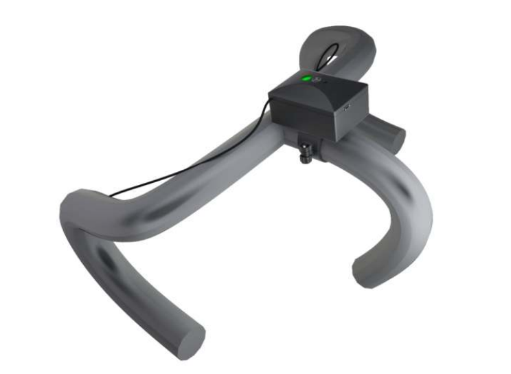
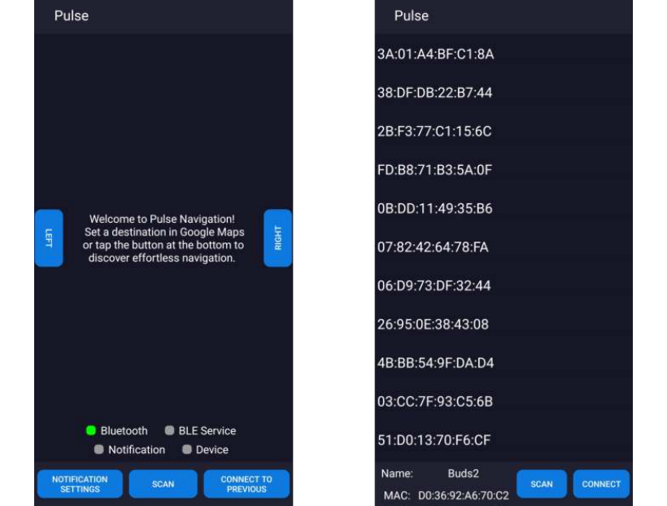
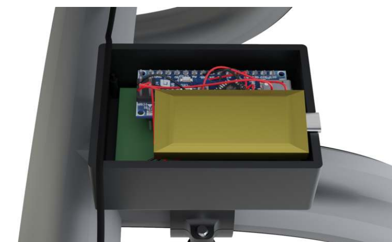

# Pulse

Pulse is a bicycle navigation device that guides you through haptic feedback instead of a
screen. It was built for the Engineering Design course (4WBB0) at Eindhoven University of
Technology (TU/e) by a five-person team spanning electrical engineering, computer science,
mechanical engineering, and industrial design. The idea is simple: cyclists should keep
their eyes on the road, so turn-by-turn directions are delivered as buzzes on the left or
right of the handlebar rather than as glances at a phone.

Video demo: https://www.youtube.com/watch?v=xY5UHygo7Wg



## How it works

Pulse has two parts: an Android app on the phone and a small device clamped to the
handlebar. They talk over Bluetooth Low Energy.

1. The rider sets a destination in Google Maps and starts navigation as usual.
2. The Android app runs a notification listener that reads Google Maps' navigation
   notification. From it the app extracts the remaining distance to the next turn and the
   maneuver icon.
3. The maneuver is classified by turning the notification icon into a bitmap and comparing
   it against a library of known direction samples. The matched maneuver and distance are
   packed into a short string such as `r:120`, meaning turn right in 120 meters.
4. The string is written to a BLE characteristic on the handlebar device.
5. The device drives two vibration buzzers, one on each side. The direction code selects
   which side buzzes and the pattern (single buzz for a turn, a repeated pattern for a
   u-turn or roundabout), while the distance sets the buzz timing so the cue grows more
   urgent as the turn approaches. A status LED shows the connection state.



## The device

The handlebar unit is an Arduino Nano ESP32 running a NimBLE GATT server, wired to two
vibration motors and a status LED, powered by a LiPo battery. The electronics sit in a
3D-printed enclosure that clamps to the handlebar with a bracket modeled on a bicycle
bell mount.



## Repository layout

```
application/          Android app (Java, Gradle)
  app/                main app module (com.example.carplay_android)
    services/         BLE client and Google Maps notification listener
    utils/            direction classification, BLE scanning, broadcasts
    javabeans/        data holders for devices, bitmaps, filters
    assets/direction_samples/   reference icons for maneuver classification
  theMapReader/       Android library module
embedded/             ESP32 firmware (PlatformIO, Arduino framework)
  src/main.cpp        BLE server, direction decoding, buzzer control
Pulse.pdf             final project report
```

## Building

### Android app

Open the `application/` folder in Android Studio and build the `app` module, or from the
command line:

```
cd application
./gradlew assembleDebug
```

The app needs Bluetooth and notification-access permissions, and it reads the Google Maps
navigation notification, so grant notification listener access in the Android settings.

### Embedded firmware

The firmware is a [PlatformIO](https://platformio.org/) project targeting the Arduino Nano
ESP32:

```
cd embedded
pio run              # build
pio run -t upload    # flash to the board
```

The only dependency is the `NimBLE-Arduino` library, declared in `platformio.ini`.

## Technologies

Java, Android SDK, Android Bluetooth Low Energy, NotificationListenerService, Gradle,
C++, Arduino framework, PlatformIO, Arduino Nano ESP32, NimBLE, 3D-printed enclosure.
